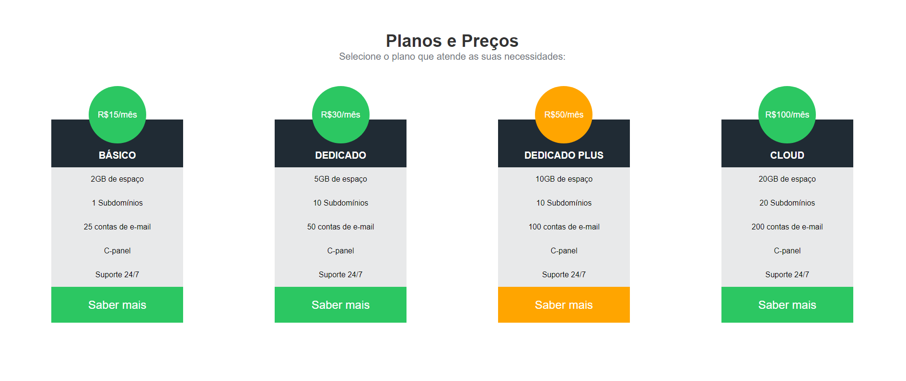

# Projeto: HDC Host

## Estrutura do projeto:

A estrutura é composta por um arquivo HTML e um arquivo CSS para estilização. Abaixo estão os principais componentes do projeto.

## Tecnologias:

### 1. HTML 

### 2. CSS 

## Como usar:

### 1. Clonar o repositório

git clone https://github.com/thiagocezar-senac/16-09-2024

### 2. Abrir o arquivo HTML

Abra o arquivo index.html em seu navegador para visualização da página.

### 3. Personalização com CSS

Você pode modificar o arquivo style.css para personalizar a aparência da página conforme preferir.

## Desenvolvedores:

- [Thiago Cézar](https://github.com/thiagocezar-senac)

## Projeto/Aula:

16-09-2024
17-09-2024
